Brawndough Code Explanations and User guide
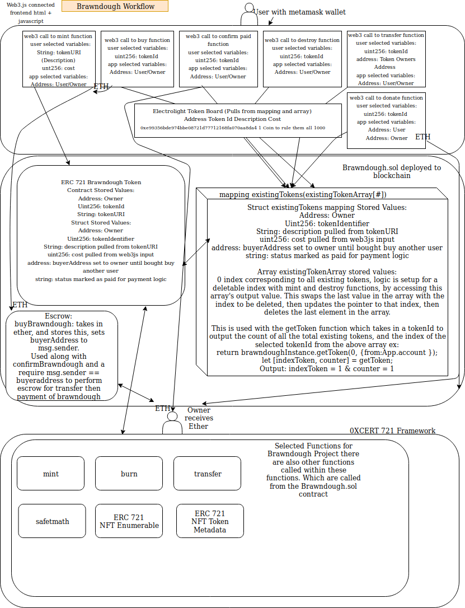
#Installation Steps Follow the steps below to download, install, and run this project.

Dependencies
Install these prerequisites to follow along with the tutorial. See free video tutorial or a full explanation of each prerequisite.
NPM: https://nodejs.org
Truffle: https://github.com/trufflesuite/truffle
Ganache: http://truffleframework.com/ganache/
Metamask: https://metamask.io/

Step 1. Clone the project
git clone https://github.com/beaugramming/brawndough.git

Step 2. Install dependencies
cd brawndough
npm install -g truffle
npm install @0xcert/ethereum-xcert
npm install
npm install lite-server --save-dev
npm run compile
npm run dev 

Step 3. Start Ganache
Open the Ganache GUI client that you downloaded and installed. This will start your local blockchain instance. See free video tutorial for full explanation.

Step 4. Compile & Deploy Brawndough Smart Contract
$ truffle migrate --reset 

Step 5. Configure Metamask
Unlock Metamask
Connect metamask to your local Etherum blockchain provided by Ganache.
Import an account provided by ganache.

Step 6. Run the Front End Application,
npm run dev

Step 7  Then visit this URL in your browser: http://localhost:3000

Import your Ganache account into Metamask then login.
Go to settings and enter for a Custom RPC url http:127.0.0.1:7545

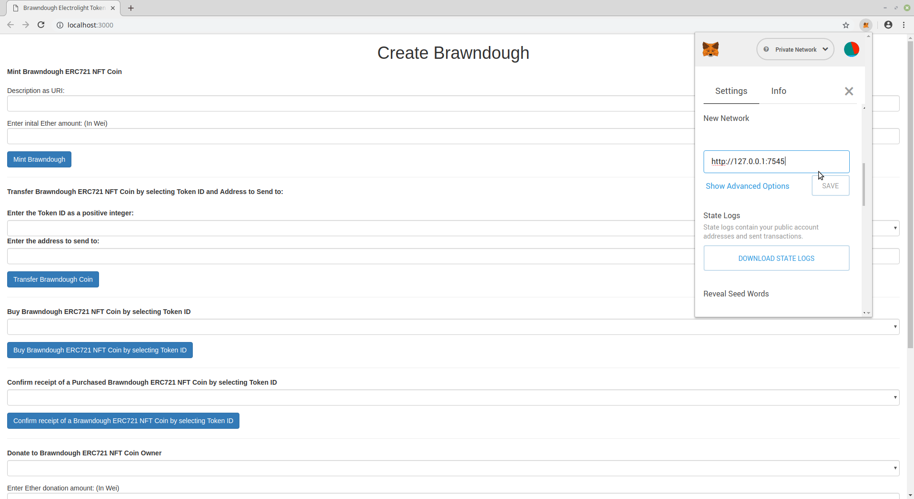

Reload the webpage you will see your account address listed:

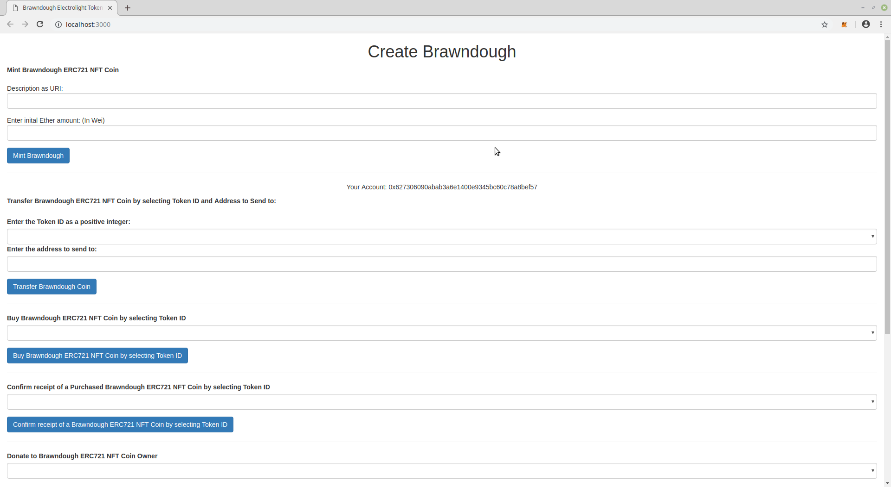

Mint a token:
Enter Description, which will be the tokenURI set for the Token.
Enter Cost, which will be the cost in Ether for buying the token.
Select Mint Brawndough:

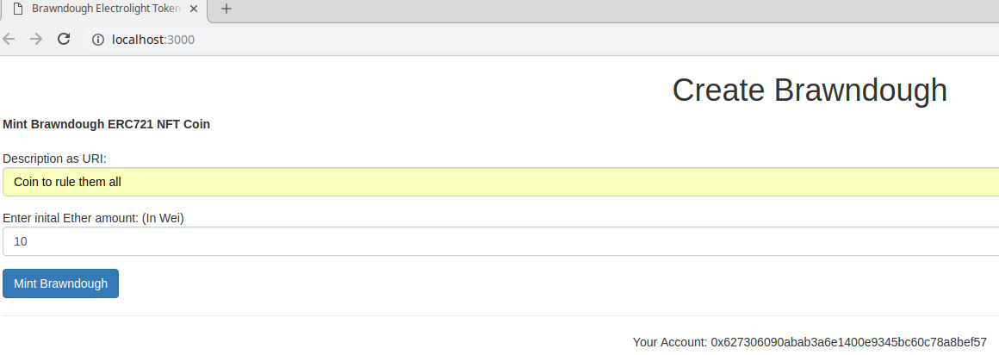

Select confirm

This will then display on the Electrolight token board:

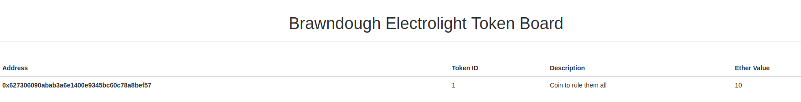

Transfer Brawndough by 
Selecting the minted token by Token ID
Entering the Address to transfer to and clicking Transfer Brawndough coin

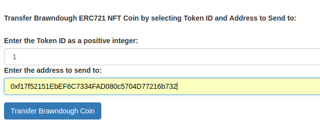

Select confirm

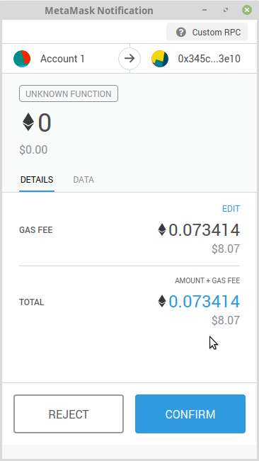

The Electrolight token board will update the address;

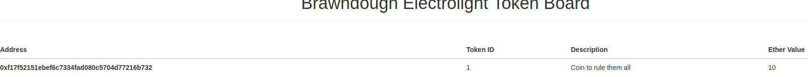

Buy Brawndough by selecting the Token Id to buy then clicking buy:
Then Select confirm, noting the correct price:

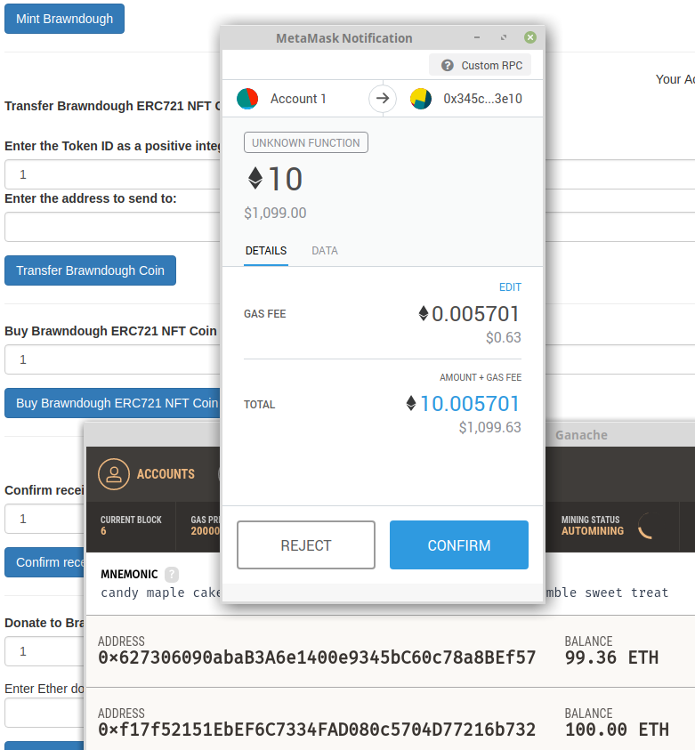

This then stores itself in escrow in the contract

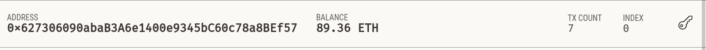

Once transferred you can then release funds to the owner:

This will show up in Ganache

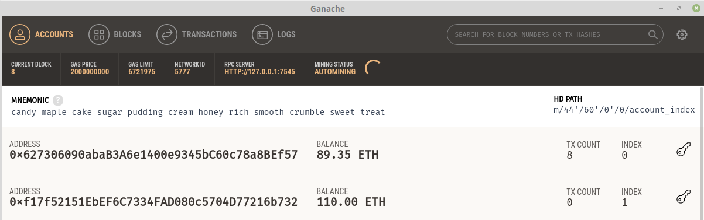

You can donate by selecting the Token ID and then entering a donation amount:
Then clicking Donate Brawndough
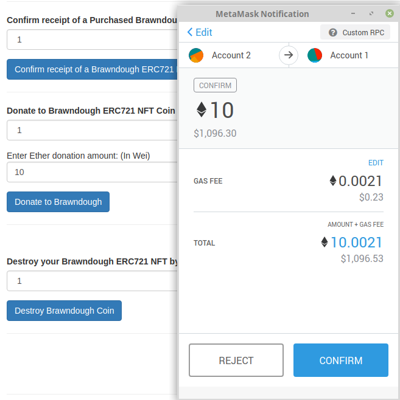
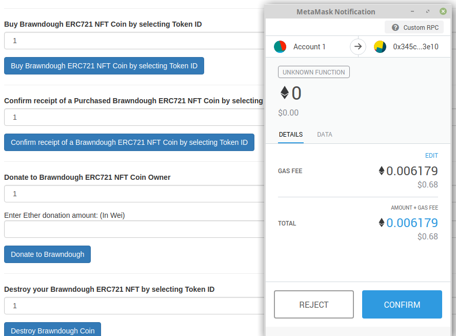

Lastly you can destroy the created Brawndough Coin:

Erasing the Electrolight Token Board

Subsequent coins minted will then receive a Token Id which increments by one, which is used on the backend logic to display the correct coins, and pull in the struct data from the solidity contract. Also there is an array, which uses a data structure, which enables a deleteable index example here are 3 coins:

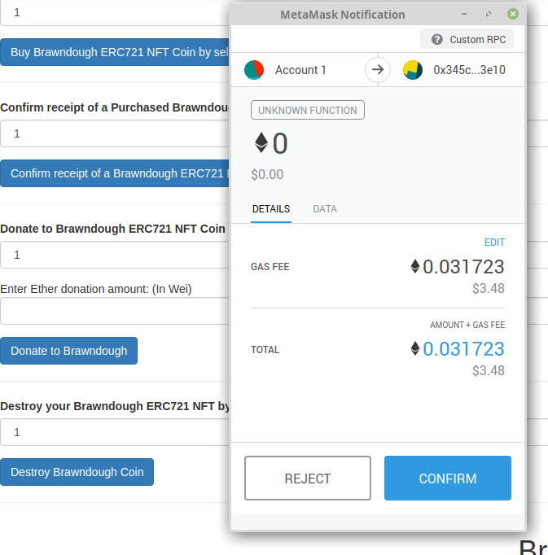
Destroying 2 then displays only 1 and 3

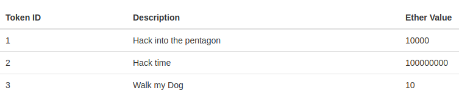
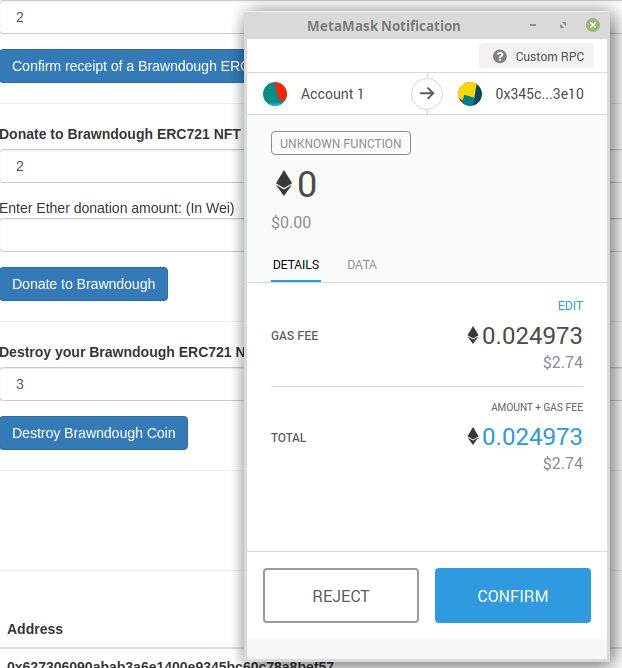
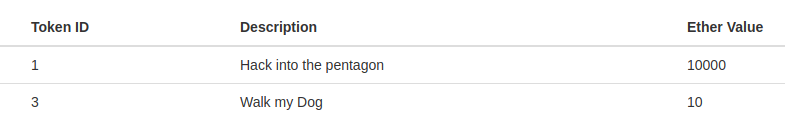

One bug of Metamask is that some transactions fail due to an incorrect account nonce, when reloading the application, and switching accounts this can be fixed by selecting reset account:
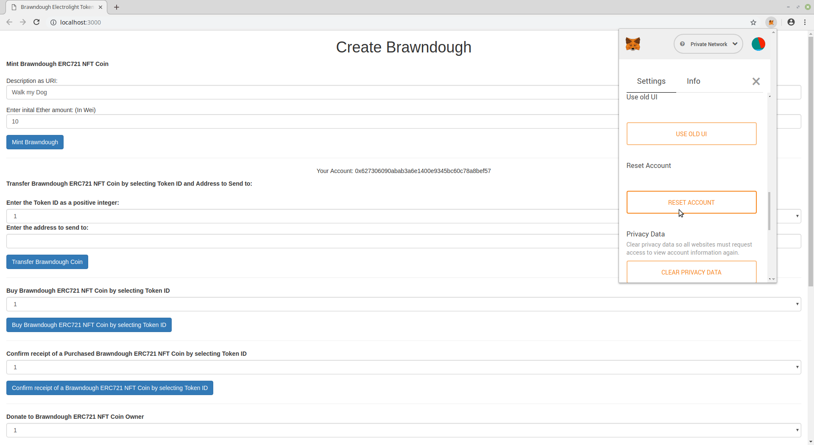

